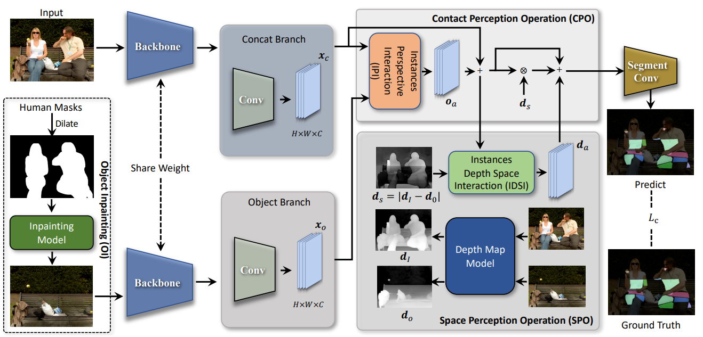

<p align="center">

  <h1 align="center">Precision-Enhanced Human-Object Contact Detection via Depth-Aware Perspective Interaction and Object Texture Restoration</h1>
  <p align="center">
    <strong>Yuxiao Wang</strong>, <strong>Wenpeng Neng</strong>, <strong>Zhenao Wei</strong>, <strong>Yu Lei</strong>, <strong>WeiYing Xue</strong>, <strong>Nan Zhuang</strong>, <strong>Yanwu Xu</strong>, <strong>Xinyu Jiang</strong>, <strong>Qi Liu</strong>
  </p>
  <h2 align="center">Accepted by AAAI 2025</h2>
  <div align="center">
    
  </div>

  <p align="left">
    <a href='https://arxiv.org/abs/2412.09920'>
      
    </a>
    <a href='https://drive.google.com/drive/folders/1q4FthmRXZiue7vZFar4KD2sSu3yPdjSE?usp=sharing'>
      
    </a>
</p>

## Environment
Please first install the follow environment:
- python 3.8
- pytorch 1.11.0 (cu113)
- torchvision 0.12.0 (cu113)

## Installation
```
pip3 install -r requirements.txt
```

## Data Preparation
- Data: download the HOT dataset from the [project website](https://hot.is.tue.mpg.de) and unzip to `/path/to/dataset`. Then:
```
cd ./data
mkdir HOT
ln -s /path/to/dataset ./data/HOT
```
The directory structure is as follows:

```
Project/
├── data/
|   |── HOT
|   |   |── HOT-Annotated
|   |   |   |── images
|   |   |   |── annotations
|   |   |   |── ...
|   |   |── HOT-Generated
|   |   |   |── images
|   |   |   |── annotations
|   |   |   |── ...
│   ├── hot_train.odgt
│   ├── hot_test.odgt
│   ├── ...

```

## Inpainting Model
We use the [LaMa](https://hot.is.tue.mpg.de) model in combination with the human mask to reconstruct the occluded object information.

Please install the environment according to the [LaMa](https://hot.is.tue.mpg.de) official library and move the [infer.py](./scripts/infer.py) in the scripts folder of this project to the LaMa project folder and run it to save the repaired image.

In order to facilitate researchers to get started quickly, we also provide an external link to the download inpainting images. Just download it and unzip it to the `./data/HOT/HOT-Annotated(HOT-Generated)/inpainting` directory. Please click [Inpainting Images](xx) to download it.

## Depth Model
[ZoeDepth](https://github.com/isl-org/ZoeDepth) is used to generate depth map. [LaMa](https://hot.is.tue.mpg.de) model in combination with the human mask to reconstruct the occluded object information.
Developers need to install the environment according to the official instructions of [ZoeDepth](https://github.com/isl-org/ZoeDepth) and save the generated depth map to the `./data/HOT/HOT-Annotated(HOT-Generated)/depth` directory.
Please note that in order to keep the original image and the inpainting image at the same perspective, they need to be spliced ​​together and sent to the [ZoeDepth](https://github.com/isl-org/ZoeDepth) model.

In order to facilitate researchers to get started quickly, we also provide an external link to the depth map. Just download it and unzip it to the `./data/HOT/HOT-Annotated(HOT-Generated)/depth` directory. Please click [Depth Map](xx) to download it.

## Training
```
python train.py --gpus 0,1,2,3 --cfg config/hot-resnet50dilated-c1.yaml
```
To choose which gpus to use, you can either do ```--gpus 0-7```, or ```--gpus 0,2,4,6```. 

You can change the parameters in `config/hot-resnet50dilated-c1.yaml` to adjust the network training process.


## Evaluation
Use the following code to evaluate the verification effect of all epochs.
```
sh ./val.sh
```

If you want to evaluate the effect of the test set on a specific epoch, you can use the following command:
```
sh ./test.sh
```
Note, remember to change the `--epoch` parameter.

After evaluating the model, use the following command to view the results. Note that this command will display the results of all epochs. If you evaluate the validation set first and then evaluate the test set of the specified epoch, the results displayed are the results of the validation set except for the specified test epoch.
```
sh ./show_loss.sh
```


## Visulization
If you want to visualize the experimental results of the test set, use the following command:
```
sh ./vis_results.sh
```
Note, remember to change the `--epoch` parameter.

## Citation

```bibtex
@article{wang2024precision,
  title={Precision-Enhanced Human-Object Contact Detection via Depth-Aware Perspective Interaction and Object Texture Restoration},
  author={Wang, Yuxiao and Neng, Wenpeng and Wei, Zhenao and Lei, Yu and Xue, Weiying and Zhuang, Nan and Xu, Yanwu and Jiang, Xinyu and Liu, Qi},
  journal={arXiv preprint arXiv:2412.09920},
  year={2024}
}
```

## Acknowledgement
For the HOT model and dataset proposed by Chen et al., please click [HOT](https://github.com/yixchen/HOT) for details.
